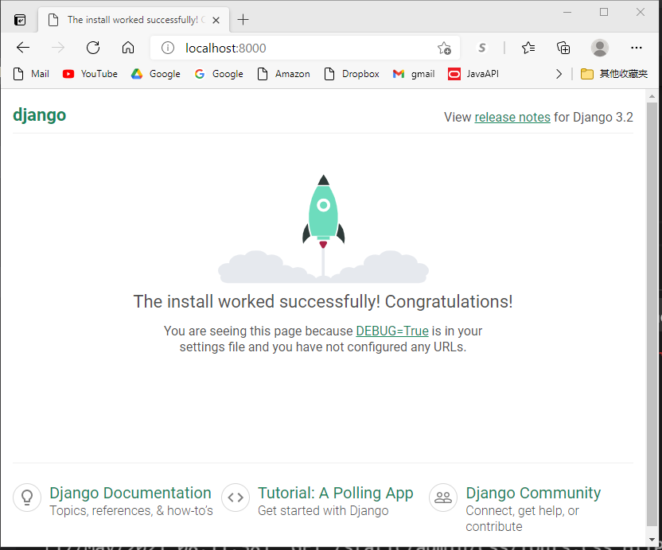
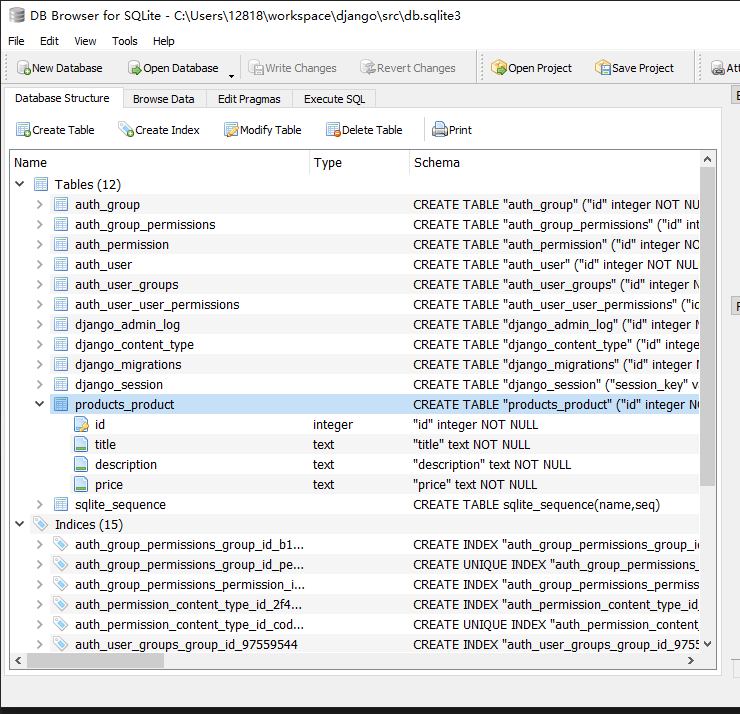
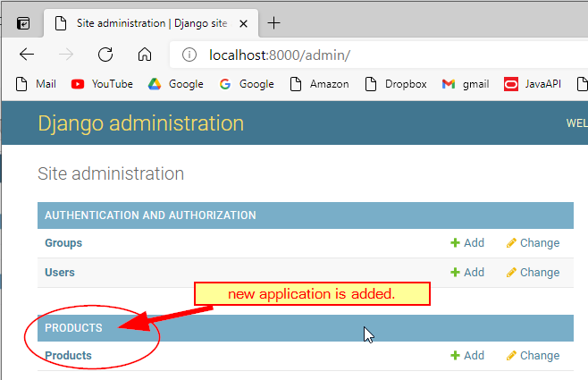

# Learn Djando

- [Learn Djando](#learn-djando)
  - [install Django module 3.2.3](#install-django-module-323)
  - [django-admin](#django-admin)
  - [Start your own application](#start-your-own-application)
  - [Python Shell](#python-shell)
  - [products/views.py](#productsviewspy)
  - [Get rid of missing favicon.ico file](#get-rid-of-missing-faviconico-file)
  - [Django Template](#django-template)
  - [References](#references)
  - [Display DB data](#display-db-data)
  - [Image Magick](#image-magick)
  - [Other related topics](#other-related-topics)
    - [Function based views](#function-based-views)
    - [Class based views](#class-based-views)


## install Django module 3.2.3
```
pip install django
python -m pip install --upgrade pip
```

check all modules that pip installed
```
pip freeze
```

## django-admin
```
django-admin
mkdir src
cd src
django-admin startproject <project name> .
django-admin startproject trydjango
python manage.py runserver
```
Open browser, type in "localhost:8000"

[localhost:8000](http://localhost:8000)

[admin](http://localhost:8000/admin/login/?next=/admin/)

Stop the app by click Ctrl+c on terminal

```
python manage.py migrate
python manage.py createsuperuser
```

## Start your own application
```
python manage.py startapp products
```
* ./products/models.py
  
    
  - Create class named Product inside models.py
  - add 'product' as INSTALLED_APP in trydjango/settings.py
  - migrate your model to database
```
python manage.py makemigrations
python manage.py migrate
```
  

You may need do these 2 commands every single time you make change on your [products/models.py](src/products/models.py)

* modify [products/admin.py](src/products/admin.py)
```py
from .models import Product
admin.site.register(Product)
```



## Python Shell

```
python manage.py shell
>>> from products.models import Product
>>> Product.objects.all()
>>> Product.objects.create(title="New product", description='new description', price='9.99',summary='this is super easy.')
```

## products/views.py

[products/views.py](src/products/views.py)
* create application named pages
```
python manage.py startapp pages
```
* modify [pages/views.py](src/pages/views.py)
* add the following code in [trydjango/urls.py](src/trydjango/urls.py)
  ```py
  from pages.views import home_view

  urlpatterns = [
    path('', home_view, name='home'),
  ]
  ```
  where pages is the application folder, and views is the python file in the folder.

## Get rid of missing favicon.ico file
* add static/images/favicon.ico file
* in trydjango/settings.py add
```py
  STATICFILES_DIRS = [os.path.join(BASE_DIR, 'static')]
```
* in trydjango/urls.py add path entry for 'favicon.ico' file
```py
from django.contrib.staticfiles.storage import staticfiles_storage
from django.views.generic.base import RedirectView

urlpatterns = [
    path('', home_view, name='home'),
    path('home/', home_view, name='home'),
    path('admin/', admin.site.urls),
    path('favicon.ico', RedirectView.as_view(url=staticfiles_storage.url('images/favicon.ico')))
]

```

* modify [views.py](src/products/views.py) under products folder
```py
from django.http import HttpResponse
from django.shortcuts import render

# Create your views here.
def home_view(*args, **kwargs):
    return HttpResponse("<h1>Hello World!</h1>")
```

* [works, but incorrect] add products/urls.py into products folder

```py
from django.contrib import admin
from django.urls import path
from products import views

urlpatterns = [
    path('', views.home_view, name='home'),
    path('admin/', admin.site.urls),
]
```
* [works, but incorrect] change the setting 'ROOT_URLCONF' point to products.urls
```
ROOT_URLCONF = 'products.urls'
```
in trydjango/settings.py file.

## Django Template
* add src/templates folder (can be named whatever you want.)
* add html files in it, [home.html](src/templates/home.html)
* Return render() in [views.py](src/pages/views.py)
```py
def home_view(request, *args, **kwargs):
    return render(request, "home.html", {})
```
* Tell Django where is the templates folder
  add 'DIRS' setting in [trydjango/settings.py](src/trydjango/settings.py) file
```py
TEMPLATES = [
    {
        'BACKEND': 'django.template.backends.django.DjangoTemplates',
        'DIRS': [os.path.join(BASE_DIR,'templates')],
        'APP_DIRS': True,
    }
]
```
* use   in both [base.html](src/templates/base.html) and templates html file such as [home.html](src/templates/home.html)
* use  in all template html file
  ```html
  
  

    <h1><font color="blue">Hello World.</font></h1>
      The user {{request.user}} is authenticated? 
      {{request.user.is_authenticated}}
      <p>This is a <font style="color:crimson;font-weight: bold;">Home Page</font> template.</p>
  

  ```


## References
* [Django Document](https://docs.djangoproject.com/en/3.2/)
* [Field Types](https://docs.djangoproject.com/en/3.2/ref/models/fields/)
* [TextField](https://docs.djangoproject.com/en/3.2/ref/models/fields/#textfield)
* CharField
* TextField
* DecimalField
* [3 hours and 45 minutes Django YouTube Video](https://www.youtube.com/watch?v=F5mRW0jo-U4)
* [Form Field Document](https://docs.djangoproject.com/en/3.2/ref/forms/fields/#charfield)

## Display DB data
1. create view function in [views.py](src/products/views.py)
2. add template html in <app>/templates/<app>/<html file name>.html file
3. add entry in [trydjango/urls.py](src/trydjango/urls.py)
4. add entry in [navbar.html](src/templates/navbar.html)
## Image Magick
Conver images from png to gif
```
magick F_*.png motion.gif
magick pencil.png favicon.ico
```
## Other related topics
[Generic editing views](https://docs.djangoproject.com/en/3.2/ref/class-based-views/generic-editing/)

### Function based views

### Class based views
* FormView
* CreateView
* UpdateView
* ListView, 
* DeleteView
  