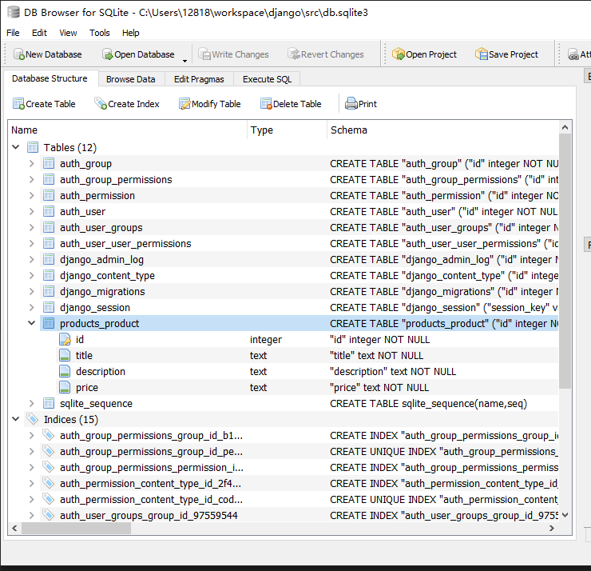
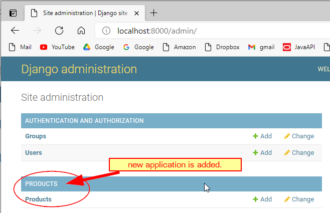
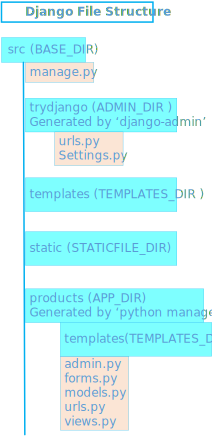

<h1>DJango Learning Notes</h1>

Click to see website: [Documentation](https://docs.djangoproject.com/en/4.0/)

Django is a free and open source web application framework, written in Python. A web framework is a set of components that helps you to develop websites faster and easier.

- [install DJango](#install-django)
- [django-admin](#django-admin)
- [Start your own application](#start-your-own-application)
- [Python Shell](#python-shell)
- [products/views.py](#productsviewspy)
- [Get rid of missing favicon.ico file](#get-rid-of-missing-faviconico-file)
- [Django Template](#django-template)
- [Display DB data](#display-db-data)
- [Image Magick](#image-magick)
- [Static files](#static-files)
- [Django File Structure](#django-file-structure)
- [Start blogs app from scratch](#start-blogs-app-from-scratch)
- [3 requirements for Django's views](#3-requirements-for-djangos-views)
- [Other related topics](#other-related-topics)
  - [Function based views](#function-based-views)
  - [Class based views](#class-based-views)
- [Django Generic Views](#django-generic-views)
- [References](#references)

## install DJango
```dos
pip install django
pip install --upgrade pip
```
check all modules that pip installed
```
pip freeze
```

## django-admin

* make sure you are running under (env)

```
django-admin
mkdir src
cd src
django-admin startproject <project name> .
django-admin startproject trydjango
python manage.py runserver
```
Open browser, type in "localhost:8000"

~~[localhost:8000](http://localhost:8000)~~

1. [admin](http://localhost:8000/admin/login/?next=/admin/)
2. [books](http://localhost:8000/books/)


Stop the app by click Ctrl+c on terminal

```
python manage.py migrate
python manage.py createsuperuser
```

## Start your own application
Switch to src/ folder, and
```
python manage.py startapp products
```
After you create the application, the file structure is
```
src/
  ├── trydjango (app main folder)
  |    └── urls.py (master navigation pathes)
  ├── templates (shared by all app)
  |    ├── base.html
  |    ├── home.html
  |    ├── contract.html
  |    ├── about.html
  |    └── navbar.html
  ├── products/ (app folder)
  |       ├── templates/products/
  |       |       ├── product_create.html
  |       |       ├── product_delete.html
  |       |       ├── product_detail.html
  |       |       ├── product_list.html
  |       |       ├── product_lookup.html
  |       |       └── product_update.html
  |       ├── admin.py (register Product)
  |       ├── apps.py (class ProductsConfig)
  |       ├── forms.py (class ProductForm, ProductRawForm)
  |       ├── models.py (Define database table and fields)
  |       ├── views.py (Define views)
  |       └── urls.py (Define router pathes only for products app)
  ├── static/
  |       ├── css/
  |       |     └── style.css
  |       └── images/
  ├── db.sqlite3
  └── manage.py (main application manager)
```
Relations between html files


Here is how Django generate views


Name the path


* ./products/models.py
  
    
  - Create class named Product inside models.py
  - add 'product' as INSTALLED_APP in trydjango/settings.py
  - migrate your model to database


```
python manage.py makemigrations
python manage.py migrate
```
  

You may need do these 2 commands every single time you make change on your [products/models.py](src/products/models.py)

* modify [products/admin.py](../src/products/admin.py)
Register Product model with admin.py
```py
from .models import Product
admin.site.register(Product)
```




## Python Shell

```
cd src
python manage.py shell
>>> from products.models import Product
>>> Product.objects.all()
>>> Product.objects.create(title="New product", description='new description', price='9.99',summary='this is super easy.')
```

## products/views.py

[products/views.py](../src/products/views.py)
* create application named pages
```
python manage.py startapp pages
```
* modify [pages/views.py](../src/pages/views.py)
* add the following code in [trydjango/urls.py](src/trydjango/urls.py)
  ```py
  from pages.views import home_view

  urlpatterns = [
    path('', home_view, name='home'),
  ]
  ```
  where pages is the application folder, and views is the python file in the folder.


## Get rid of missing favicon.ico file
* add static/images/favicon.ico file
* in trydjango/settings.py add
```py
  STATICFILES_DIRS = [os.path.join(BASE_DIR, 'static')]
```
* in trydjango/urls.py add path entry for 'favicon.ico' file
```py
from django.contrib.staticfiles.storage import staticfiles_storage
from django.views.generic.base import RedirectView

urlpatterns = [
    path('', home_view, name='home'),
    path('home/', home_view, name='home'),
    path('admin/', admin.site.urls),
    path('favicon.ico', RedirectView.as_view(url=staticfiles_storage.url('images/favicon.ico')))
]

```

* modify [views.py](../src/products/views.py) under products folder
```py
from django.http import HttpResponse
from django.shortcuts import render

# Create your views here.
def home_view(*args, **kwargs):
    return HttpResponse("<h1>Hello World!</h1>")
```

* [works, but incorrect] add products/urls.py into products folder

```py
from django.contrib import admin
from django.urls import path
from products import views

urlpatterns = [
    path('', views.home_view, name='home'),
    path('admin/', admin.site.urls),
]
```
* [works, but incorrect] change the setting 'ROOT_URLCONF' point to products.urls
```
ROOT_URLCONF = 'products.urls'
```
in trydjango/settings.py file.


## Django Template
* add src/templates folder (can be named whatever you want.)
* add html files in it, [home.html](../src/templates/home.html)
* Return render() in [views.py](../src/pages/views.py)
```py
def home_view(request, *args, **kwargs):
    return render(request, "home.html", {})
```
* Tell Django where is the templates folder
  add 'DIRS' setting in [trydjango/settings.py](src/trydjango/settings.py) file
```py
TEMPLATES = [
    {
        'BACKEND': 'django.template.backends.django.DjangoTemplates',
        'DIRS': [os.path.join(BASE_DIR,'templates')],
        'APP_DIRS': True,
    }
]
```
* use   in both [base.html](../src/templates/base.html) and templates html file such as [home.html](../src/templates/home.html)
* use  in all template html file
  ```html
  
  

    <h1><font color="blue">Hello World.</font></h1>
      The user {{request.user}} is authenticated? 
      {{request.user.is_authenticated}}
      <p>This is a <font style="color:crimson;font-weight: bold;">Home Page</font> template.</p>
  

  ```

[Learn Djando](#learn-djando)

## Display DB data
1. create view function in [views.py](../src/products/views.py)
2. add template html in <app>/templates/<app>/<html file name>.html file
3. add entry in [trydjango/urls.py](../src/trydjango/urls.py)
4. add entry in [navbar.html](../src/templates/navbar.html)
## Image Magick
Conver images from png to gif
```
magick F_*.png motion.gif
magick pencil.png favicon.ico
```


## Static files
[STATIC_URL](https://docs.djangoproject.com/en/3.2/howto/static-files/)

Modify [settings.py](../src/trydjango/settings.py)
```py
STATIC_URL = '/static/'
STATIC_ROOT = os.path.join(BASE_DIR, 'static')
```

## Django File Structure



Sample Django File Structure
```
├── db.sqlite3 (database file)
├── manage.py  (start up program)
├── wordapp
│   ├── __init__.py
│   ├── settings.py
│   ├── urls.py
│   └── wsgi.py
└── wordcountapp
    ├── admin.py
    ├── __init__.py
    ├── migrations
    │   ├── __init__.py
    ├── models.py
    ├── static
    │   └── css
    │       └── style.css
    ├── templates
    │   └── index.html
    ├── tests.py
    ├── urls.py
    └── views.py
```

## Start blogs app from scratch
* generate src/blogs folder
```
Start blogs app from scratch
```
* add app entry in [trydjango/settings.py](../src/trydjango/settings.py)

    ```py

    INSTALLED_APPS = [
        'django.contrib.admin',
        'django.contrib.auth',
        'django.contrib.contenttypes',
        'django.contrib.sessions',
        'django.contrib.messages',
        'django.contrib.staticfiles',
        # my own
        'school',
        'products',
        'blogs',
    ]
    ```
* define a model class Blog in [blogs/models.py](../src/blogs/models.py)
* register the mode in [blogs/admin.py](../src/blogs/admin.py)
* migrate data model Blog to database
  ```
  python manage.py makemigrations
  python manage.py migrate
  ```

  

* create [blogs/templates/blogs_list_view.html](../src/blogs/templates/blogs/blogs_list_view.html)
* define blog_list_view() function in [blogs/views.py](../src/blogs/views.py)
* add entry in [trydjango/urls.py](../src/trydjango/urls.py)

## 3 requirements for Django's views
1. They are callable. A view can be either function or a class-based view. CBVs inherit the method as_view() which uses a dispatch() method to call the appropriate method depending on the HTTP verb (get, post, etc),
2. They must accept an HttpRequest object as its first positional argument,
3. They must return an HttpResponse object or raise an exception.

## Other related topics
[Generic editing views](https://docs.djangoproject.com/en/3.2/ref/class-based-views/generic-editing/)

[好文][Class based view vs. Function based view](https://medium.com/@ksarthak4ever/django-class-based-views-vs-function-based-view-e74b47b2e41b)


<h3>Keep that in mind: class-based views does not replace function-based views.</h3>

### Function based views

### Class based views
* FormView
* CreateView
* UpdateView
* ListView, 
* DeleteView

## Django Generic Views
* create a books app
```
cd src
python manage.py startapp books
```

## References
* [Django Document](https://docs.djangoproject.com/en/3.2/)
* [Field Types](https://docs.djangoproject.com/en/3.2/ref/models/fields/)
* [TextField](https://docs.djangoproject.com/en/3.2/ref/models/fields/#textfield)
* CharField
* TextField
* DecimalField
* [3 hours and 45 minutes Django YouTube Video](https://www.youtube.com/watch?v=F5mRW0jo-U4)
* [Form Field Document](https://docs.djangoproject.com/en/3.2/ref/forms/fields/#charfield)
* [Built in template tags](## References
* [Django Document](https://docs.djangoproject.com/en/3.2/)
* [Field Types](https://docs.djangoproject.com/en/3.2/ref/models/fields/)
* [TextField](https://docs.djangoproject.com/en/3.2/ref/models/fields/#textfield)
* CharField
* TextField
* DecimalField
* [3 hours and 45 minutes Django YouTube Video](https://www.youtube.com/watch?v=F5mRW0jo-U4)
* [Form Field Document](https://docs.djangoproject.com/en/3.2/ref/forms/fields/#charfield)
* [template tags](https://docs.djangoproject.com/en/3.2/ref/templates/builtins/)
  *  
  * 
  *  

